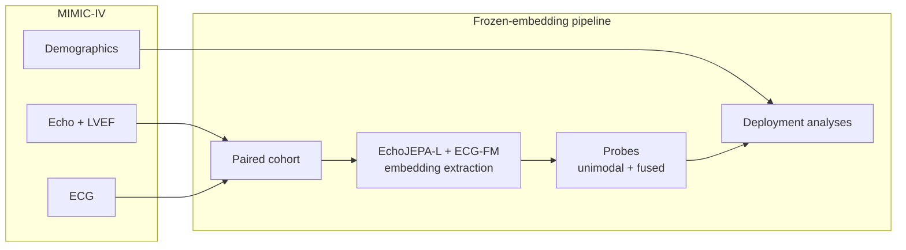

<p align="center">
  <h1 align="center">PRIMED-AI</h1>
  <p align="center">
    <strong>EchoJEPA + ECG-FM: frozen-embedding, deployment-risk study of multimodal LVEF estimation</strong>
  </p>
  <p align="center">
    <a href="https://github.com/criticaldata/PRIMED-AI">criticaldata/PRIMED-AI</a>
  </p>
</p>

---

## Overview

**PRIMED-AI** studies whether fusing two cardiac foundation models — **EchoJEPA-L** (echocardiogram video) and **ECG-FM** (12-lead ECG) — can estimate left ventricular ejection fraction (LVEF) in a way that is ready for real-world deployment, not just benchmark accuracy.

The pipeline uses **frozen embeddings only**: foundation models act as fixed feature extractors; all task-specific learning happens in lightweight probes on top of cached representations.

> *ECG is ubiquitous and cheap; echo requires a sonographer and a cart. If we train a fused model but only ECG is available at inference, how much accuracy do we lose — and does the model degrade gracefully or fail silently?*

**Target venue:** [DAIH @ COLM 2026](https://colmweb.org/workshops.html) (Deploying AI in Healthcare) · Submission deadline: June 23, 2026

---

## Motivation

LVEF is a core measure of heart pump function, used to diagnose heart failure and guide treatment. Echocardiography is accurate but resource-intensive; ECG is cheap, fast, and available almost everywhere.

Most multimodal ML papers ask whether fusion beats unimodal baselines on a leaderboard. This project reframes the question for a **deployment-and-risk** audience:

| DAIH pillar | What we evaluate |
|-------------|------------------|
| **Does it work?** | Missing-modality robustness when echo or ECG is unavailable at inference |
| **Is it equitable?** | Fairness audit of EF error across sex, age, and race |
| **Is it safe?** | Whether accuracy degrades gracefully or fails silently under shift |

Fusion vs. unimodal accuracy is **supporting evidence**, not the thesis.

---

## Architecture



| Stage | Role |
|-------|------|
| **Cohort construction** | Pair echo ↔ ECG on `subject_id` within 24–48h; join structured LVEF labels |
| **Embedding extraction** | Frozen forward passes over paired cohort only (~few K–tens of K studies, not all 525K echos) |
| **Probes** | ECG-only, echo-only (attentive), concat-MLP, and cross-attention fusion heads |
| **Deployment analyses** | Missing-modality ablation, fairness stratification, optional calibration |

See [TECHNICAL.md](./TECHNICAL.md) for full pipeline details.

---

## Models & data

| Component | Source |
|-----------|--------|
| **EchoJEPA-L** | Video JEPA for echo · [arXiv:2602.02603](https://arxiv.org/abs/2602.02603) |
| **ECG-FM** | wav2vec2-style ECG foundation model · [arXiv:2408.05178](https://arxiv.org/abs/2408.05178) · [Hugging Face](https://huggingface.co/bowang-lab/ECG-FM) |
| **MIMIC-IV-Echo** 0.1 | Echo DICOM + structured LVEF · [PhysioNet](https://physionet.org/content/mimic-iv-echo/0.1/) |
| **MIMIC-IV-ECG** 1.0 | 12-lead waveforms · [PhysioNet](https://physionet.org/content/mimic-iv-ecg/1.0/) |
| **MIMIC-IV** 3.1 | Demographics for fairness audit · [PhysioNet](https://physionet.org/content/mimic-iv/3.1/) |

All MIMIC datasets require PhysioNet credentialing and signed Data Use Agreements.

**Scope:** Task A — continuous LVEF regression + EF≤40% binary clinical gate (HFrEF threshold). Valvular disease and HFpEF phenotyping are out of scope for this sprint.

---

## Metrics

| Metric | Purpose |
|--------|---------|
| **LVEF MAE** | Continuous regression quality |
| **EF≤40% AUROC** | Clinical gate for reduced ejection fraction |
| **Missing-modality degradation** | Δ MAE / Δ AUROC when echo or ECG is dropped at inference |
| **Fairness gap** | Per-stratum error across sex, age band, and race |

---

## Repository guide

| Document | Contents |
|----------|----------|
| [OVERVIEW.md](./OVERVIEW.md) | DAIH submission strategy, framing, sprint timeline, go/no-go criteria |
| [TECHNICAL.md](./TECHNICAL.md) | Pipeline architecture, probes, deployment analyses, expected artifacts |
| [TASK.md](./TASK.md) | Task board with 33 GitHub issues for the 5–7 person team |

**Contributing:** Pick a task from [TASK.md](./TASK.md) or the [issue tracker](https://github.com/criticaldata/PRIMED-AI/issues). Each issue maps to a task ID (`I##`, `D##`, `M##`, `E##`, `W##`) with steps and acceptance criteria.

---

## Status

Active research sprint for DAIH @ COLM 2026 (June 17–23, 2026).

| Milestone | Target |
|-----------|--------|
| Paired cohort + embeddings | Day 1–2 |
| Probes + missing-modality eval | Day 2–3 |
| Go/no-go (Research Paper vs. Case Report) | End of Day 3 |
| Fairness audit + paper draft | Day 4–5 |
| Submit on OpenReview | Day 6 |

Code, configs, and experiment scripts will land as tasks are completed. Critical path: **EchoJEPA-L weight access** → cohort → embeddings → missing-modality evaluation.

---

## Related work

| Work | Relationship |
|------|--------------|
| [EchoJEPA](https://arxiv.org/abs/2602.02603) | Echo foundation model used in this pipeline |
| [ECG-FM](https://arxiv.org/abs/2408.05178) | ECG foundation model used in this pipeline |
| [EchoingECG](https://arxiv.org/abs/2509.25791) | Closest prior cross-modal echo+ECG work — differentiated on frozen-embedding fusion + deployment-risk framing |

---

## Citation

If you use this work, please cite (placeholder — update when a preprint or paper is available):

```bibtex
@misc{primedai2026,
  title        = {PRIMED-AI: Deployment-Risk Study of Multimodal LVEF Estimation with EchoJEPA and ECG-FM},
  author       = {Critical Data},
  year         = {2026},
  howpublished = {\url{https://github.com/criticaldata/PRIMED-AI}}
}
```

---

## License

TBD.

---

<p align="center">
  <sub>PRIMED-AI · Critical Data</sub>
</p>
