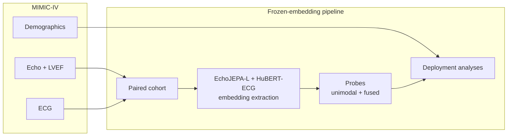

<p align="center">
  <h1 align="center">PRIMED-AI</h1>
  <p align="center">
    <strong>EchoJEPA + HuBERT-ECG: frozen-embedding, deployment-risk study of multimodal LVEF estimation</strong>
  </p>
  <p align="center">
    <a href="https://github.com/criticaldata/PRIMED-AI">criticaldata/PRIMED-AI</a>
  </p>
</p>

---

## Overview

**PRIMED-AI** studies whether fusing two cardiac foundation models — **EchoJEPA-L** (echocardiogram video) and **HuBERT-ECG** (12-lead ECG) — can estimate left ventricular ejection fraction (LVEF) in a way that is ready for real-world deployment, not just benchmark accuracy.

The pipeline uses **frozen embeddings only**: foundation models act as fixed feature extractors; all task-specific learning happens in lightweight probes on top of cached representations.

> **Which ECG encoder?** The reported results use pre-extracted **HuBERT-ECG** embeddings. The repo
> also ships a frozen **ECG-FM** wrapper ([`encoders/ecg_fm.py`](./src/primed_ai/encoders/ecg_fm.py),
> [`scripts/extract_ecg_embeddings.py`](./scripts/extract_ecg_embeddings.py)) as an alternative
> extraction path — it is implemented and unit-tested but did **not** produce any reported number.

> *ECG is ubiquitous and cheap; echo requires a sonographer and a cart. If we train a fused model but only ECG is available at inference, how much accuracy do we lose — and does the model degrade gracefully or fail silently?*

---

## Motivation

LVEF is a core measure of heart pump function, used to diagnose heart failure and guide treatment. Echocardiography is accurate but resource-intensive; ECG is cheap, fast, and available almost everywhere.

Most multimodal ML papers ask whether fusion beats unimodal baselines on a leaderboard. This project asks the **deployment-and-risk** questions instead:

| Question | What we evaluate |
|----------|------------------|
| **Does it work?** | Missing-modality robustness when echo or ECG is unavailable at inference |
| **Is it equitable?** | Fairness audit of EF error across sex, age, and race |
| **Is it safe?** | Whether accuracy degrades gracefully or fails silently under shift |

Fusion vs. unimodal accuracy is **supporting evidence**, not the thesis.

---

## Architecture



| Stage | Role |
|-------|------|
| **Cohort construction** | Pair echo ↔ ECG on `subject_id` within 24–48h; join structured LVEF labels |
| **Embedding extraction** | Frozen forward passes over paired cohort only (~few K–tens of K studies, not all 525K echos) |
| **Probes** | ECG-only, echo-only (attentive), concat-MLP, and cross-attention fusion heads |
| **Deployment analyses** | Missing-modality ablation, fairness stratification, optional calibration |

See [TECHNICAL.md](./TECHNICAL.md) for full pipeline details.

---

## Models & data

| Component | Source |
|-----------|--------|
| **EchoJEPA-L** | Video JEPA for echo · [arXiv:2602.02603](https://arxiv.org/abs/2602.02603) |
| **HuBERT-ECG** | Self-supervised 12-lead ECG model (HuBERT/wav2vec2 family) — **produced the reported ECG embeddings** |
| **ECG-FM** | Alternative ECG foundation model · [arXiv:2408.05178](https://arxiv.org/abs/2408.05178) · [Hugging Face](https://huggingface.co/wanglab/ecg-fm) — wrapper shipped, not used for reported results |
| **MIMIC-IV-Echo** 0.1 | Echo DICOM + structured LVEF · [PhysioNet](https://physionet.org/content/mimic-iv-echo/0.1/) |
| **MIMIC-IV-ECG** 1.0 | 12-lead waveforms · [PhysioNet](https://physionet.org/content/mimic-iv-ecg/1.0/) |
| **MIMIC-IV** 3.1 | Demographics for fairness audit · [PhysioNet](https://physionet.org/content/mimic-iv/3.1/) |

All MIMIC datasets require PhysioNet credentialing and signed Data Use Agreements.

**Scope:** Task A — continuous LVEF regression + EF≤40% binary clinical gate (HFrEF threshold). Valvular disease and HFpEF phenotyping are out of scope for this sprint.

---

## Metrics

| Metric | Purpose |
|--------|---------|
| **LVEF MAE** | Continuous regression quality |
| **EF≤40% AUROC** | Clinical gate for reduced ejection fraction |
| **Missing-modality degradation** | Δ MAE / Δ AUROC when echo or ECG is dropped at inference |
| **Fairness gap** | Per-stratum error across sex, age band, and race |

## Missing-modality evaluation

Evaluate the trained M09 cross-attention checkpoint under full, echo-dropped, and ECG-dropped inference conditions:

```bash
python scripts/evaluate_missing_modality.py \
  --cohort data/raw/cohort/paired_with_splits.parquet \
  --echo-embeddings data/interim/echo_study_embeddings_vjepa2.1-vitl-mimic-pt-100.parquet \
  --ecg-embeddings data/interim/hubert_ecg_embeddings.parquet \
  --checkpoint probes/cross_attn_fused/cross_attn_fused.pt \
  --embed-dim 256 \
  --echo-dim 1024 \
  --ecg-dim 768 \
  --out results/missing_modality_real.json
```

The `--embed-dim`, `--echo-dim`, and `--ecg-dim` flags must match the checkpoint architecture.

---

The evaluator loads one fused checkpoint trained on both modalities and scores the held-out test
split under three inference-time conditions — no separate unimodal models are trained for the
dropped conditions:

| Condition | Inference input |
|-----------|-----------------|
| `full` | Echo + ECG present |
| `echo_dropped` | Echo branch masked/zeroed, ECG present |
| `ecg_dropped` | ECG branch masked/zeroed, echo present |

Results are written to `results/missing_modality.json` with the checkpoint path, input data paths,
seed, model dimensions, test-set size, and a machine-readable `metrics_table`.

**Reproducibility caveat:** `results/`, `probes/`, and `data/` are gitignored, so the cohort,
embeddings, and checkpoints behind the reported numbers are not in this repository. Reproducing
them requires PhysioNet credentialing and access to a cluster holding the MIMIC data and the
foundation-model checkpoints.

---

## Repository guide

| Document | Contents |
|----------|----------|
| [TECHNICAL.md](./TECHNICAL.md) | Pipeline architecture, probes, deployment analyses, expected artifacts |
| [docs/embeddings.md](./docs/embeddings.md) | Embedding extraction, model registry, output formats |
| [CONTRIBUTING.md](./CONTRIBUTING.md) | Local setup, tests, linting, data-access rules |

**Contributing:** See [CONTRIBUTING.md](./CONTRIBUTING.md) for setup, and the [issue tracker](https://github.com/criticaldata/PRIMED-AI/issues) for open work.

---

## Status

The work pivoted from a fusion benchmark to a model-agnostic **modality-failure analysis
framework** — failure taxonomy, complementarity matrix, and loud-vs-silent dropout profile. That
framework is the main contribution and lives in
[src/primed_ai/failure/](./src/primed_ai/failure/); the fusion pipeline described above is the
substrate it is instantiated on.

Still open: PhysioNet credentialing and reserved GPU/storage, both needed for the canonical
real-data rerun.

---

## Related work

| Work | Relationship |
|------|--------------|
| [EchoJEPA](https://arxiv.org/abs/2602.02603) | Echo foundation model used in this pipeline |
| [ECG-FM](https://arxiv.org/abs/2408.05178) | Alternative ECG foundation model — wrapper shipped, not used for reported results |
| [EchoingECG](https://arxiv.org/abs/2509.25791) | Closest prior cross-modal echo+ECG work — differentiated on frozen-embedding fusion + deployment-risk framing |

---

## Citation

If you use this work, please cite the repository:

```bibtex
@misc{primedai2026,
  title        = {PRIMED-AI: Deployment-Risk Study of Multimodal LVEF Estimation with EchoJEPA and HuBERT-ECG},
  author       = {Critical Data},
  year         = {2026},
  howpublished = {\url{https://github.com/criticaldata/PRIMED-AI}}
}
```

---

## License

MIT — see [LICENSE](./LICENSE).

`scripts/embedding_extraction/src/` is vendored V-JEPA code from Meta Platforms and stays under its
own MIT license (see [scripts/embedding_extraction/src/LICENSE](./scripts/embedding_extraction/src/LICENSE)).

---

<p align="center">
  <sub>PRIMED-AI · Critical Data</sub>
</p>
