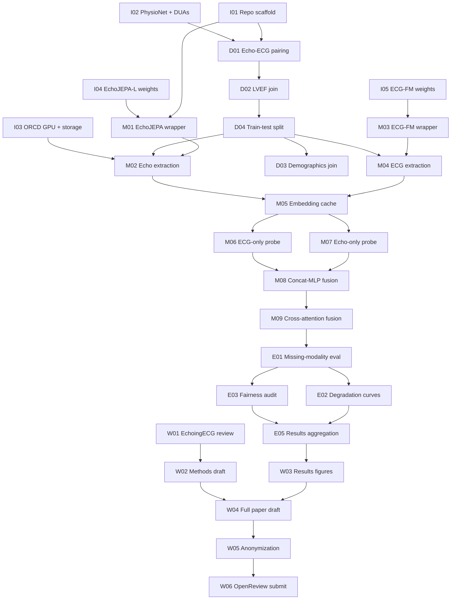

# TASK.md — PRIMED-AI Research Task Board

> **EchoJEPA + ECG-FM: frozen-embedding, deployment-risk study of multimodal LVEF estimation**
>
> This document breaks the DAIH @ COLM 2026 sprint into actionable tasks for a **5–7 person team**. Each task has a local ID, a linked GitHub issue slot, and estimated effort assuming **~1–2 hours of contributor time per day**.
>
> See [OVERVIEW.md](./OVERVIEW.md) for submission strategy and [TECHNICAL.md](./TECHNICAL.md) for pipeline details.

## Status tracker — updated Jun 20, 2026 (Day 4)

| ID | Status | Notes |
|----|--------|-------|
| **I01** | ✅ Done | Repo scaffold complete — `pyproject.toml`, `Makefile` (pip + uv), `CONTRIBUTING.md`, pytest + ruff config. Issue #13 closed. |
| **I04** | ✅ Unblocked | EchoJEPA weights downloaded from Alif's Google Drive to ORCD (`/orcd/pool/006/lceli_shared/weights/`): `vjepa21_vitl_mimic_pt117.pt`, `vitl-scratch-pt-210-c25.pt`, `vjepa2_1_vitb_mimic_pt169_c60.pt`. M01 wrapper can proceed. |
| **D03** | 🔄 In review | PR #38 open (@tigerkrittaphas) — merge conflict in `pyproject.toml`. Author pinged to rebase. |
| **D04** | ✅ Done | `scripts/make_splits.py` merged (PR #39). Subject-level 70/10/20 split with zero-leakage check and reproducible manifest. Issue #4 closed. |
| **D06** | ✅ Done | `scripts/check_ef40_prevalence.py` merged (PR #40). Reports prevalence overall + per split, flags AUROC reportability. Issue #6 closed. |
| **M05** | ✅ Done | `src/primed_ai/embeddings/cache.py` merged (PR #42). On-disk `.npy` cache with atomic writes, resume support, JSONL manifest. Issue #23 closed. |
| **All others** | ⬜ Not started | — |

---

## Quick links

| Resource | URL |
|----------|-----|
| Repository | https://github.com/criticaldata/PRIMED-AI |
| DAIH @ COLM 2026 CFP | https://colmweb.org/workshops.html *(verify current URL)* |
| ECG-FM (Hugging Face) | https://huggingface.co/bowang-lab/ECG-FM |
| EchoJEPA paper | https://arxiv.org/abs/2602.02603 |
| ECG-FM paper | https://arxiv.org/abs/2408.05178 |
| EchoingECG (prior work) | https://arxiv.org/abs/2509.25791 |
| MIMIC-IV-Echo | https://physionet.org/content/mimic-iv-echo/1.0/ |
| MIMIC-IV-ECG | https://physionet.org/content/mimic-iv-ecg/1.0/ |
| MIMIC-IV | https://physionet.org/content/mimic-iv/3.1/ |

## Sprint constraints

| Field | Value |
|-------|-------|
| **Submission deadline** | June 23, 2026 (AoE) |
| **Scope** | Task A — LVEF only (continuous + EF≤40% gate) |
| **Approach** | Frozen embeddings only — no foundation-model fine-tuning |
| **Team size** | 5–7 active members |
| **Go/no-go checkpoint** | End of Day 3 — Research Paper vs. Case Report fallback |
| **Critical path** | EchoJEPA-L weights → paired cohort → embeddings → missing-modality eval |

## ID convention

| Prefix | Category | Example |
|--------|----------|---------|
| `I##` | Infrastructure | Task one of Infrastructure → **I01** |
| `D##` | Data | Task one of Data → **D01** |
| `M##` | Model | Task one of Model → **M01** |
| `E##` | Evaluation | Task one of Evaluation → **E01** |
| `W##` | Writing & submission | Task one of Writing → **W01** |

> **GitHub issues:** 33 issues created — see task index and category sections below.

## Suggested execution order

## Sprint calendar (parallel work)

| Day | Date | Parallel tracks |
|-----|------|-----------------|
| **Day 1** | Tue Jun 17 | **I02, I03, I04, I05** (access + compute) · **D01–D04** (cohort) · **I01** (scaffold) |
| **Day 2** | Wed Jun 18 | **M01–M05** (embeddings) · **M06–M08** (quick probes) · **W01** (related work) |
| **Day 3** | Thu Jun 19 | **M09** (fusion) · **E01–E02** (missing modality) · **GO/NO-GO** |
| **Day 4** | Fri Jun 20 | **E03–E05** (fairness + aggregation) · **W02–W03** (draft + figures) |
| **Day 5** | Sat Jun 21 | **W04** (full paper) · **E04** (calibration, stretch) |
| **Day 6** | Sun–Mon | **W05–W06** (anonymize + submit early) |

## Task index

| ID | Status | GitHub Issue | Category | Title | Priority | Complexity | Est. days | Owner | References |
|----|--------|--------------|----------|-------|----------|------------|-----------|-------|------------|
| **I01** | ✅ Done | [#13](https://github.com/criticaldata/PRIMED-AI/issues/13) | Infrastructure | Repository scaffold and development environment | High | Low | 2 | — | — |
| **I02** | ⬜ | [#14](https://github.com/criticaldata/PRIMED-AI/issues/14) | Infrastructure | PhysioNet credentialing and DUA verification | High | Low | 1 | — | — |
| **I03** | ⬜ | [#15](https://github.com/criticaldata/PRIMED-AI/issues/15) | Infrastructure | ORCD GPU reservation and storage layout | High | Low | 1 | — | — |
| **I04** | ✅ Unblocked | [#16](https://github.com/criticaldata/PRIMED-AI/issues/16) | Infrastructure | EchoJEPA-L weights access (private) | **Critical** | Medium | 2 | — | R1 |
| **I05** | ⬜ | [#17](https://github.com/criticaldata/PRIMED-AI/issues/17) | Infrastructure | ECG-FM weights pull and smoke test | High | Low | 1 | — | R2 |
| **I06** | ⬜ | [#18](https://github.com/criticaldata/PRIMED-AI/issues/18) | Infrastructure | Experiment config, logging, and reproducibility | Medium | Low | 2 | — | — |
| **D01** | ⬜ | [#1](https://github.com/criticaldata/PRIMED-AI/issues/1) | Data | Echo↔ECG temporal pairing (24–48h window) | High | Medium | 2 | — | — |
| **D02** | ⬜ | [#2](https://github.com/criticaldata/PRIMED-AI/issues/2) | Data | LVEF label join and cohort validation | High | Low | 1 | — | — |
| **D03** | 🔄 In review | [#3](https://github.com/criticaldata/PRIMED-AI/issues/3) | Data | Demographics join (sex, age, race) | High | Low | 1 | — | — |
| **D04** | ✅ Done | [#4](https://github.com/criticaldata/PRIMED-AI/issues/4) | Data | Subject-level train / val / test split | High | Low | 1 | — | — |
| **D05** | ⬜ | [#5](https://github.com/criticaldata/PRIMED-AI/issues/5) | Data | Cohort flow diagram and exclusion statistics | Medium | Low | 1 | — | — |
| **D06** | ✅ Done | [#6](https://github.com/criticaldata/PRIMED-AI/issues/6) | Data | EF≤40% prevalence sanity check | High | Low | 1 | — | — |
| **M01** | ⬜ | [#19](https://github.com/criticaldata/PRIMED-AI/issues/19) | Model | Frozen EchoJEPA-L encoder wrapper | High | Medium | 2 | — | R1 |
| **M02** | ⬜ | [#20](https://github.com/criticaldata/PRIMED-AI/issues/20) | Model | Echo embedding extraction pipeline | High | Medium | 2 | — | R1 |
| **M03** | ⬜ | [#21](https://github.com/criticaldata/PRIMED-AI/issues/21) | Model | Frozen ECG-FM encoder wrapper | High | Low | 1 | — | R2 |
| **M04** | ⬜ | [#22](https://github.com/criticaldata/PRIMED-AI/issues/22) | Model | ECG embedding extraction pipeline | High | Low | 2 | — | R2 |
| **M05** | ✅ Done | [#23](https://github.com/criticaldata/PRIMED-AI/issues/23) | Model | Embedding cache storage layer | High | Medium | 2 | — | — |
| **M06** | ⬜ | [#24](https://github.com/criticaldata/PRIMED-AI/issues/24) | Model | ECG-only probe (linear / MLP) | High | Low | 1 | — | R2 |
| **M07** | ⬜ | [#25](https://github.com/criticaldata/PRIMED-AI/issues/25) | Model | Echo-only attentive probe | High | Medium | 2 | — | R1 |
| **M08** | ⬜ | [#26](https://github.com/criticaldata/PRIMED-AI/issues/26) | Model | Quick-win concat-MLP fused probe | High | Low | 1 | — | — |
| **M09** | ⬜ | [#27](https://github.com/criticaldata/PRIMED-AI/issues/27) | Model | Cross-attention fused probe | High | High | 3 | — | R3 |
| **E01** | ⬜ | [#7](https://github.com/criticaldata/PRIMED-AI/issues/7) | Evaluation | Missing-modality evaluation protocol | **Critical** | Medium | 2 | — | — |
| **E02** | ⬜ | [#8](https://github.com/criticaldata/PRIMED-AI/issues/8) | Evaluation | Degradation curve figures | **Critical** | Low | 1 | — | — |
| **E03** | ⬜ | [#9](https://github.com/criticaldata/PRIMED-AI/issues/9) | Evaluation | Fairness stratification (sex, age, race) | High | Low | 1 | — | — |
| **E04** | ⬜ | [#10](https://github.com/criticaldata/PRIMED-AI/issues/10) | Evaluation | EF≤40% calibration (optional stretch) | Low | Low | 1 | — | — |
| **E05** | ⬜ | [#11](https://github.com/criticaldata/PRIMED-AI/issues/11) | Evaluation | Metrics aggregation and result tables | High | Low | 1 | — | — |
| **E06** | ⬜ | [#12](https://github.com/criticaldata/PRIMED-AI/issues/12) | Evaluation | ECG-FM pooling ablation (mean vs attentive) | Medium | Low | 1 | — | R2 |
| **W01** | ⬜ | [#28](https://github.com/criticaldata/PRIMED-AI/issues/28) | Writing | EchoingECG review and differentiation paragraph | High | Low | 1 | — | R3 |
| **W02** | ⬜ | [#29](https://github.com/criticaldata/PRIMED-AI/issues/29) | Writing | Methods and data section draft | High | Medium | 2 | — | — |
| **W03** | ⬜ | [#30](https://github.com/criticaldata/PRIMED-AI/issues/30) | Writing | Results figures (degradation + fairness) | High | Low | 1 | — | — |
| **W04** | ⬜ | [#31](https://github.com/criticaldata/PRIMED-AI/issues/31) | Writing | Full paper draft (8pp research / 4pp fallback) | High | High | 3 | — | — |
| **W05** | ⬜ | [#32](https://github.com/criticaldata/PRIMED-AI/issues/32) | Writing | Anonymization pass | High | Low | 1 | — | — |
| **W06** | ⬜ | [#33](https://github.com/criticaldata/PRIMED-AI/issues/33) | Writing | OpenReview submission | High | Low | 1 | — | — |

---

## Infrastructure (`I##`)

Repo scaffolding, data access, compute, and model weight acquisition.

**6 tasks** · [I01](https://github.com/criticaldata/PRIMED-AI/issues/13) · [I02](https://github.com/criticaldata/PRIMED-AI/issues/14) · [I03](https://github.com/criticaldata/PRIMED-AI/issues/15) · [I04](https://github.com/criticaldata/PRIMED-AI/issues/16) · [I05](https://github.com/criticaldata/PRIMED-AI/issues/17) · [I06](https://github.com/criticaldata/PRIMED-AI/issues/18)

#### I01 — Repository scaffold and development environment

| Field | Value |
|-------|-------|
| **GitHub Issue** | [#13](https://github.com/criticaldata/PRIMED-AI/issues/13) |
| **Category** | Infrastructure |
| **Features / method** | Project layout, `pyproject.toml`, dev deps, pre-commit, `CONTRIBUTING.md` |
| **Priority** | High |
| **Complexity** | Low |
| **Est. days** | 2 *(~1–2 h/day)* |
| **Key references** | — |

**Description**

Set up the foundational repository structure for parallel work across 5–7 contributors.

**Steps:**
1. Create standard layout: `src/primed_ai/`, `configs/`, `scripts/`, `tests/`, `data/README.md` (no raw MIMIC data in git).
2. Add `pyproject.toml` with pinned core deps (PyTorch, numpy, pandas, hydra-core or similar).
3. Add `Makefile` or `justfile` with `install`, `lint`, `test` targets.
4. Configure pre-commit (ruff/black or equivalent).
5. Document local setup in `CONTRIBUTING.md` (Python version, CUDA, MIMIC data paths on ORCD).

**Acceptance criteria:**
- Fresh clone → `pip install -e .` works.
- `pytest` runs (even if empty).
- Lint passes on scaffold files.
- Directory layout matches [TECHNICAL.md §13](./TECHNICAL.md#13-expected-artifacts).

---

#### I02 — PhysioNet credentialing and DUA verification

| Field | Value |
|-------|-------|
| **GitHub Issue** | [#14](https://github.com/criticaldata/PRIMED-AI/issues/14) |
| **Category** | Infrastructure |
| **Features / method** | Credentialing checklist for all 5–7 team members across three MIMIC datasets |
| **Priority** | High |
| **Complexity** | Low |
| **Est. days** | 1 *(~1–2 h/day)* |
| **Key references** | — |

**Description**

Verify every active team member can access MIMIC-IV-Echo, MIMIC-IV-ECG, and MIMIC-IV before any data work begins.

**Steps:**
1. Maintain a shared checklist (spreadsheet or issue comment) of member → credentialing status.
2. Confirm signed DUAs for MIMIC-IV-Echo 0.1, MIMIC-IV-ECG 1.0, MIMIC-IV 3.1.
3. Document data paths on ORCD and who has read access.
4. Block cohort construction (D01) until all active extractors are credentialed.

**Acceptance criteria:**
- Checklist shows ✅ for all members who will touch data.
- Data root paths documented in `configs/paths.yaml` or equivalent.

---

#### I03 — ORCD GPU reservation and storage layout

| Field | Value |
|-------|-------|
| **GitHub Issue** | [#15](https://github.com/criticaldata/PRIMED-AI/issues/15) |
| **Category** | Infrastructure |
| **Features / method** | H200 (or equivalent) reservation, embedding cache disk budget |
| **Priority** | High |
| **Complexity** | Low |
| **Est. days** | 1 *(~1–2 h/day)* |
| **Key references** | — |

**Description**

Reserve compute and confirm storage for embedding extraction on the paired cohort only.

**Steps:**
1. Reserve GPU on ORCD (H200 preferred; any capable GPU acceptable for subsetted cohort).
2. Estimate disk for cached echo + ECG embeddings; allocate scratch or project storage.
3. Document job submission template (Slurm or cluster-specific).
4. Smoke-test one GPU job before Day 2 extraction batch.

**Acceptance criteria:**
- GPU reservation confirmed through Day 6.
- Storage path for `embeddings/` documented and writable.

---

#### I04 — EchoJEPA-L weights access (private)

| Field | Value |
|-------|-------|
| **GitHub Issue** | [#16](https://github.com/criticaldata/PRIMED-AI/issues/16) |
| **Category** | Infrastructure |
| **Features / method** | Private weight retrieval from model authors pending PhysioNet release |
| **Priority** | **Critical** |
| **Complexity** | Medium |
| **Est. days** | 2 *(~1–2 h/day)* |
| **Key references** | [R1](#references) |

**Description**

**Single most important blocker.** EchoJEPA-L weights are pending public PhysioNet approval. Secure private access from Alif's team (email or private HF repo) by end of Day 1; pivot by end of Day 2 if unavailable.

**Steps:**
1. Email Alif's team for EchoJEPA-L weights — chase Day 1.
2. Verify checkpoint loads and produces expected embedding dimension on one dummy echo clip.
3. Document weight path, version hash, and loading instructions in `configs/encoder/echojepa.yaml`.
4. If weights not received by end of Day 2, trigger fallback (ECG-FM-only study or Case Report — see [OVERVIEW.md §5](./OVERVIEW.md#5-blockers--risk-register)).

**Acceptance criteria:**
- Checkpoint loads in `EchoJEPALEncoder` without error.
- One forward pass on sample input returns stable embedding shape.
- **Fallback documented** if weights unavailable.

---

#### I05 — ECG-FM weights pull and smoke test

| Field | Value |
|-------|-------|
| **GitHub Issue** | [#17](https://github.com/criticaldata/PRIMED-AI/issues/17) |
| **Category** | Infrastructure |
| **Features / method** | Hugging Face download, inference smoke test |
| **Priority** | High |
| **Complexity** | Low |
| **Est. days** | 1 *(~1–2 h/day)* |
| **Key references** | [R2](#references) |

**Description**

Pull publicly available ECG-FM weights and verify inference on a sample 12-lead ECG.

**Steps:**
1. Download ECG-FM from Hugging Face.
2. Run forward pass on one MIMIC-IV-ECG record (or synthetic waveform).
3. Record embedding shape, dtype, and pooling options in `configs/encoder/ecg_fm.yaml`.
4. Confirm frozen mode (no gradients into backbone).

**Acceptance criteria:**
- Weights cached on ORCD.
- Smoke test log saved to `logs/ecg_fm_smoke.txt`.

---

#### I06 — Experiment config, logging, and reproducibility

| Field | Value |
|-------|-------|
| **GitHub Issue** | [#18](https://github.com/criticaldata/PRIMED-AI/issues/18) |
| **Category** | Infrastructure |
| **Features / method** | Hydra/YAML configs, seed control, run manifests |
| **Priority** | Medium |
| **Complexity** | Low |
| **Est. days** | 2 *(~1–2 h/day)* |
| **Key references** | — |

**Description**

Ensure every extraction run and probe training run is traceable and reproducible.

**Steps:**
1. Choose config framework (recommended: Hydra + OmegaConf).
2. Define base config: paths, seeds, device, batch size, pairing window (24h vs 48h).
3. Add config groups: `encoder/`, `cohort/`, `probe/`, `eval/`.
4. Standardize `set_seed()` across numpy/torch/python.
5. Auto-save resolved config + git SHA with each run artifact.

**Acceptance criteria:**
- Single command launches cohort build, extraction, or probe train with named preset.
- Config snapshot saved per run under `logs/`.

---

## Data (`D##`)

Paired cohort construction, labels, splits, and cohort documentation.

**6 tasks** · [D01](https://github.com/criticaldata/PRIMED-AI/issues/1) · [D02](https://github.com/criticaldata/PRIMED-AI/issues/2) · [D03](https://github.com/criticaldata/PRIMED-AI/issues/3) · [D04](https://github.com/criticaldata/PRIMED-AI/issues/4) · [D05](https://github.com/criticaldata/PRIMED-AI/issues/5) · [D06](https://github.com/criticaldata/PRIMED-AI/issues/6)

#### D01 — Echo↔ECG temporal pairing (24–48h window)

| Field | Value |
|-------|-------|
| **GitHub Issue** | [#1](https://github.com/criticaldata/PRIMED-AI/issues/1) |
| **Category** | Data |
| **Features / method** | Join on `subject_id` + nearest ECG within configurable time window |
| **Priority** | High |
| **Complexity** | Medium |
| **Est. days** | 2 *(~1–2 h/day)* |
| **Key references** | — |

**Description**

Build the paired cohort **before** any embedding extraction. Do not process all ~525K echos.

**Steps:**
1. Implement `scripts/build_cohort.py`: for each echo study, find nearest ECG on same `subject_id` within 24–48h.
2. Resolve multi-match edge cases: when multiple ECGs fall in window, take nearest timestamp.
3. Emit paired table: `subject_id`, `echo_study_id`, `ecg_record_id`, echo timestamp, ECG timestamp, `delta_hours`.
4. Log exclusion counts at each filter step.
5. Export to `cohort/paired.parquet` (or CSV).

**Acceptance criteria:**
- Cohort size in expected range (few thousand to tens of thousands).
- No duplicate `(subject_id, echo_study_id)` rows unless explicitly allowed and documented.
- Pairing script reruns deterministically from same inputs.

---

#### D02 — LVEF label join and cohort validation

| Field | Value |
|-------|-------|
| **GitHub Issue** | [#2](https://github.com/criticaldata/PRIMED-AI/issues/2) |
| **Category** | Data |
| **Features / method** | Structured LVEF from MIMIC-IV-Echo; range and missingness checks |
| **Priority** | High |
| **Complexity** | Low |
| **Est. days** | 1 *(~1–2 h/day)* |
| **Key references** | — |

**Description**

Join continuous LVEF labels and validate label distribution for regression and EF≤40% gate.

**Steps:**
1. Join structured LVEF from MIMIC-IV-Echo to paired cohort.
2. Drop or flag rows with missing / out-of-range LVEF (document rules).
3. Add derived column: `ef_le_40 = (lvef <= 40)`.
4. Report LVEF summary stats (mean, std, min, max, missing rate).

**Acceptance criteria:**
- Final cohort table includes `lvef` and `ef_le_40` columns.
- Summary stats logged to `logs/cohort_summary.json`.

---

#### D03 — Demographics join (sex, age, race)

| Field | Value |
|-------|-------|
| **GitHub Issue** | [#3](https://github.com/criticaldata/PRIMED-AI/issues/3) |
| **Category** | Data |
| **Features / method** | MIMIC-IV Clinical demographics for fairness stratification |
| **Priority** | High |
| **Complexity** | Low |
| **Est. days** | 1 *(~1–2 h/day)* |
| **Key references** | — |

**Description**

Join demographics needed for the fairness audit (E03).

**Steps:**
1. Join `subject_id` to MIMIC-IV patients table for sex, anchor age, race.
2. Derive age bands for stratification (document bin edges).
3. Flag known MIMIC gender-curation limitations in cohort metadata.
4. Report demographic coverage (% non-missing per field).

**Acceptance criteria:**
- Cohort table includes `sex`, `age`, `age_band`, `race`.
- Coverage report saved; missingness documented for paper limitations section.

---

#### D04 — Subject-level train / val / test split

| Field | Value |
|-------|-------|
| **GitHub Issue** | [#4](https://github.com/criticaldata/PRIMED-AI/issues/4) |
| **Category** | Data |
| **Features / method** | Fixed split by `subject_id`; no patient leakage |
| **Priority** | High |
| **Complexity** | Low |
| **Est. days** | 1 *(~1–2 h/day)* |
| **Key references** | — |

**Description**

Create a held-out test split partitioned by patient, not by study or record.

**Steps:**
1. Split unique `subject_id` values into train / val / test (document ratios, e.g. 70/10/20).
2. Assign split label to every cohort row via `subject_id` lookup.
3. Verify zero `subject_id` overlap across splits.
4. Save split manifest to `cohort/splits.json` with seed and hash.

**Acceptance criteria:**
- Assert no `subject_id` appears in more than one split.
- Split reproducible from saved seed + manifest.

---

#### D05 — Cohort flow diagram and exclusion statistics

| Field | Value |
|-------|-------|
| **GitHub Issue** | [#5](https://github.com/criticaldata/PRIMED-AI/issues/5) |
| **Category** | Data |
| **Features / method** | CONSORT-style flow counts for paper Figure 1 |
| **Priority** | Medium |
| **Complexity** | Low |
| **Est. days** | 1 *(~1–2 h/day)* |
| **Key references** | — |

**Description**

Produce exclusion counts at each cohort filter step for the paper data section.

**Steps:**
1. Tabulate: total echos → with LVEF → with ECG pair → final cohort → per split.
2. Generate flow diagram (Mermaid, TikZ, or draw.io export).
3. Save table to `results/cohort_flow.csv`.

**Acceptance criteria:**
- Every exclusion step has a count and brief rule description.
- Figure ready for paper draft by Day 4.

---

#### D06 — EF≤40% prevalence sanity check

| Field | Value |
|-------|-------|
| **GitHub Issue** | [#6](https://github.com/criticaldata/PRIMED-AI/issues/6) |
| **Category** | Data |
| **Features / method** | Prevalence check before locking AUROC results |
| **Priority** | High |
| **Complexity** | Low |
| **Est. days** | 1 *(~1–2 h/day)* |
| **Key references** | — |

**Description**

Confirm EF≤40% prevalence in the paired cohort is high enough for stable AUROC estimation.

**Steps:**
1. Report EF≤40% prevalence overall and per split (train / val / test).
2. If test-set prevalence is too low, document constraint or adjust reporting (e.g., bootstrap CIs).
3. Block final AUROC numbers (E05) until this check passes review.

**Acceptance criteria:**
- Prevalence table in `results/ef40_prevalence.csv`.
- Team sign-off that AUROC is reportable (or limitation noted).

---

## Model (`M##`)

Frozen embedding extraction and probe training.

**9 tasks** · [M01](https://github.com/criticaldata/PRIMED-AI/issues/19) · [M02](https://github.com/criticaldata/PRIMED-AI/issues/20) · [M03](https://github.com/criticaldata/PRIMED-AI/issues/21) · [M04](https://github.com/criticaldata/PRIMED-AI/issues/22) · [M05](https://github.com/criticaldata/PRIMED-AI/issues/23) · [M06](https://github.com/criticaldata/PRIMED-AI/issues/24) · [M07](https://github.com/criticaldata/PRIMED-AI/issues/25) · [M08](https://github.com/criticaldata/PRIMED-AI/issues/26) · [M09](https://github.com/criticaldata/PRIMED-AI/issues/27)

#### M01 — Frozen EchoJEPA-L encoder wrapper

| Field | Value |
|-------|-------|
| **GitHub Issue** | [#19](https://github.com/criticaldata/PRIMED-AI/issues/19) |
| **Category** | Model |
| **Features / method** | `encode(echo_video) -> embedding` API with frozen weights |
| **Priority** | High |
| **Complexity** | Medium |
| **Est. days** | 2 *(~1–2 h/day)* |
| **Key references** | [R1](#references) |

**Description**

Wrap EchoJEPA-L as a frozen representation extractor for echo DICOM/video input.

**Steps:**
1. Implement `EchoJEPALEncoder` loading checkpoint from I04.
2. Freeze all parameters; eval mode + `torch.no_grad()` forward.
3. Document input preprocessing (frame sampling, resolution, normalization).
4. Return token-level or clip-level embeddings (configurable; default matches probe needs).
5. Unit test: output dim matches config on dummy batch.

**Acceptance criteria:**
- Forward pass on dummy echo returns stable embedding shape.
- No gradients flow into encoder when `frozen=true`.

---

#### M02 — Echo embedding extraction pipeline

| Field | Value |
|-------|-------|
| **GitHub Issue** | [#20](https://github.com/criticaldata/PRIMED-AI/issues/20) |
| **Category** | Model |
| **Features / method** | Batch encoding over paired cohort with resume support |
| **Priority** | High |
| **Complexity** | Medium |
| **Est. days** | 2 *(~1–2 h/day)* |
| **Key references** | [R1](#references) |

**Description**

Run frozen EchoJEPA-L forward passes on **paired cohort only** and cache embeddings.

**Steps:**
1. Read paired cohort manifest (D01–D04).
2. Load echo DICOM/video paths; batch for GPU throughput.
3. Write embeddings incrementally to M05 cache with resume checkpoints.
4. Log throughput (studies/sec) and failures.
5. **Do not** encode the full 525K echo corpus.

**Acceptance criteria:**
- All paired-cohort echo studies encoded without duplicate keys.
- Extraction resumable after interrupt.

---

#### M03 — Frozen ECG-FM encoder wrapper

| Field | Value |
|-------|-------|
| **GitHub Issue** | [#21](https://github.com/criticaldata/PRIMED-AI/issues/21) |
| **Category** | Model |
| **Features / method** | `encode(ecg_waveform) -> embedding` API with frozen weights |
| **Priority** | High |
| **Complexity** | Low |
| **Est. days** | 1 *(~1–2 h/day)* |
| **Key references** | [R2](#references) |

**Description**

Wrap ECG-FM as a frozen representation extractor for 12-lead ECG input.

**Steps:**
1. Implement `ECGFMEncoder` loading Hugging Face weights from I05.
2. Freeze backbone; document waveform preprocessing (length, leads, normalization).
3. Return sequence embeddings before pooling (pooling deferred to probe).
4. Unit test on synthetic 12-lead input.

**Acceptance criteria:**
- Stable embedding shape on dummy ECG batch.
- Frozen mode verified.

---

#### M04 — ECG embedding extraction pipeline

| Field | Value |
|-------|-------|
| **GitHub Issue** | [#22](https://github.com/criticaldata/PRIMED-AI/issues/22) |
| **Category** | Model |
| **Features / method** | Batch encoding over paired cohort ECG records |
| **Priority** | High |
| **Complexity** | Low |
| **Est. days** | 2 *(~1–2 h/day)* |
| **Key references** | [R2](#references) |

**Description**

Run frozen ECG-FM forward passes on paired cohort ECG records and cache embeddings.

**Steps:**
1. Read paired cohort manifest; map `ecg_record_id` to waveform files.
2. Batch encode with dynamic batch sizing for OOM safety.
3. Write to M05 cache keyed by `ecg_record_id`.
4. Log failures and retry policy.

**Acceptance criteria:**
- All paired-cohort ECG records encoded.
- Cache keys align 1:1 with cohort rows.

---

#### M05 — Embedding cache storage layer

| Field | Value |
|-------|-------|
| **GitHub Issue** | [#23](https://github.com/criticaldata/PRIMED-AI/issues/23) |
| **Category** | Model |
| **Features / method** | Disk cache for echo + ECG embeddings keyed by study/record ID |
| **Priority** | High |
| **Complexity** | Medium |
| **Est. days** | 2 *(~1–2 h/day)* |
| **Key references** | — |

**Description**

Fast read/write storage so probe training never re-runs foundation models.

**Steps:**
1. Define schema: `record_id`, `modality`, `embedding`, `encoder_version`, `timestamp`.
2. Implement read/write API (zarr, HDF5, or `.pt` shards — pick one).
3. Support random access by ID for probe `Dataset` classes.
4. Document expected disk usage for paired cohort.

**Acceptance criteria:**
- Load arbitrary embedding by ID in <50ms from SSD.
- Probes read from cache only during training iteration.

---

#### M06 — ECG-only probe (linear / MLP)

| Field | Value |
|-------|-------|
| **GitHub Issue** | [#24](https://github.com/criticaldata/PRIMED-AI/issues/24) |
| **Category** | Model |
| **Features / method** | Pooled ECG-FM embedding → LVEF regression head |
| **Priority** | High |
| **Complexity** | Low |
| **Est. days** | 1 *(~1–2 h/day)* |
| **Key references** | [R2](#references) |

**Description**

Unimodal baseline for ECG-only LVEF prediction.

**Steps:**
1. Pool ECG-FM embeddings (mean pooling default; compare in E06).
2. Train linear probe first; upgrade to MLP if needed.
3. Predict continuous LVEF; derive EF≤40% gate.
4. Report val MAE and EF≤40% AUROC.

**Acceptance criteria:**
- Val metrics logged; beats naive mean-LVEF baseline.
- Checkpoint saved to `probes/ecg_only/`.

---

#### M07 — Echo-only attentive probe

| Field | Value |
|-------|-------|
| **GitHub Issue** | [#25](https://github.com/criticaldata/PRIMED-AI/issues/25) |
| **Category** | Model |
| **Features / method** | Attentive pooling over EchoJEPA embeddings → LVEF head |
| **Priority** | High |
| **Complexity** | Medium |
| **Est. days** | 2 *(~1–2 h/day)* |
| **Key references** | [R1](#references) |

**Description**

Unimodal baseline for echo-only LVEF prediction. **Attentive pooling required** — linear probe on raw EchoJEPA embeddings is expected to underperform.

**Steps:**
1. Implement attentive pooling layer over spatial/token EchoJEPA embeddings.
2. Train probe head for continuous LVEF regression.
3. Compare attentive vs linear pooling on val set (brief ablation note).
4. Report val MAE and EF≤40% AUROC.

**Acceptance criteria:**
- Attentive probe outperforms linear probe on val MAE.
- Checkpoint saved to `probes/echo_only/`.

---

#### M08 — Quick-win concat-MLP fused probe

| Field | Value |
|-------|-------|
| **GitHub Issue** | [#26](https://github.com/criticaldata/PRIMED-AI/issues/26) |
| **Category** | Model |
| **Features / method** | `concat(pool(echo), pool(ecg)) → MLP → LVEF` |
| **Priority** | High |
| **Complexity** | Low |
| **Est. days** | 1 *(~1–2 h/day)* |
| **Key references** | — |

**Description**

Day 2 target — get a fused number on the board before cross-attention fusion is ready.

**Steps:**
1. Pool echo (attentive) and ECG (mean/attentive) embeddings separately.
2. Concatenate → MLP → continuous LVEF.
3. Train on train split; select hyperparams on val.
4. Report val MAE vs unimodal baselines (M06, M07).

**Acceptance criteria:**
- End-to-end fused result logged by end of Day 2.
- Checkpoint saved to `probes/concat_mlp/`.

---

#### M09 — Cross-attention fused probe

| Field | Value |
|-------|-------|
| **GitHub Issue** | [#27](https://github.com/criticaldata/PRIMED-AI/issues/27) |
| **Category** | Model |
| **Features / method** | Cross-attention over echo ⊕ ECG → LVEF head |
| **Priority** | High |
| **Complexity** | High |
| **Est. days** | 3 *(~1–2 h/day)* |
| **Key references** | [R3](#references) |

**Description**

Headline fusion model used for missing-modality deployment analysis (E01).

**Steps:**
1. Implement cross-attention fusion module over echo and ECG token embeddings.
2. Train for continuous LVEF on train; tune on val.
3. Support inference-time masking of echo or ECG branch (for E01).
4. Report val MAE and EF≤40% AUROC vs M08 concat baseline.

**Acceptance criteria:**
- Fusion model supports masked inference (echo dropped / ECG dropped).
- Checkpoint saved to `probes/cross_attn_fused/`.
- Val metrics competitive with or better than M08.

---

## Evaluation (`E##`)

Deployment analyses, metrics, and publication-ready outputs.

**6 tasks** · [E01](https://github.com/criticaldata/PRIMED-AI/issues/7) · [E02](https://github.com/criticaldata/PRIMED-AI/issues/8) · [E03](https://github.com/criticaldata/PRIMED-AI/issues/9) · [E04](https://github.com/criticaldata/PRIMED-AI/issues/10) · [E05](https://github.com/criticaldata/PRIMED-AI/issues/11) · [E06](https://github.com/criticaldata/PRIMED-AI/issues/12)

#### E01 — Missing-modality evaluation protocol

| Field | Value |
|-------|-------|
| **GitHub Issue** | [#7](https://github.com/criticaldata/PRIMED-AI/issues/7) |
| **Category** | Evaluation |
| **Features / method** | Full / echo-dropped / ECG-dropped inference on fused probe |
| **Priority** | **Critical** |
| **Complexity** | Medium |
| **Est. days** | 2 *(~1–2 h/day)* |
| **Key references** | — |

**Description**

**Centerpiece analysis.** Train fused probe on full modalities; evaluate under inference-time missing inputs.

**Steps:**
1. Load M09 checkpoint trained on full (echo + ECG) data.
2. Evaluate on held-out test split under three conditions:
   - **Full:** both modalities present
   - **Echo dropped:** mask/zero echo branch — simulates ECG-only deployment
   - **ECG dropped:** mask/zero ECG branch — simulates echo-only deployment
3. Report MAE and EF≤40% AUROC per condition.
4. **Do not** retrain separate unimodal models for dropped conditions — test the deployed fused model.

**Acceptance criteria:**
- Test metrics table for all three conditions saved to `results/missing_modality.json`.
- Results reproducible from checkpoint + config.

---

#### E02 — Degradation curve figures

| Field | Value |
|-------|-------|
| **GitHub Issue** | [#8](https://github.com/criticaldata/PRIMED-AI/issues/8) |
| **Category** | Evaluation |
| **Features / method** | MAE and AUROC degradation plots — **money figure 1** |
| **Priority** | **Critical** |
| **Complexity** | Low |
| **Est. days** | 1 *(~1–2 h/day)* |
| **Key references** | — |

**Description**

Visualize accuracy loss when modalities are missing at inference.

**Steps:**
1. Plot degradation curve: x = modality condition, y = MAE (and separate panel for EF≤40% AUROC).
2. Include error bars or bootstrap CIs if sample size allows.
3. Export publication-ready PDF/PNG to `results/figures/degradation_curve.pdf`.
4. Write 2–3 sentence caption draft for paper.

**Acceptance criteria:**
- Figure finalized by end of Day 4 (locked for paper).
- Caption answers: graceful degradation vs silent failure?

---

#### E03 — Fairness stratification (sex, age, race)

| Field | Value |
|-------|-------|
| **GitHub Issue** | [#9](https://github.com/criticaldata/PRIMED-AI/issues/9) |
| **Category** | Evaluation |
| **Features / method** | Post-hoc EF error and AUROC by demographic stratum — **money figure 2** |
| **Priority** | High |
| **Complexity** | Low |
| **Est. days** | 1 *(~1–2 h/day)* |
| **Key references** | — |

**Description**

Cheap post-hoc equity audit on test-set predictions from E01 (full-modality condition at minimum; extend to dropped conditions if time).

**Steps:**
1. Stratify test predictions by sex, age band, race (D03).
2. Report per-stratum MAE and EF≤40% AUROC.
3. Flag strata with small sample size; note MIMIC gender-curation bias.
4. Export table + bar/box plot to `results/fairness/`.

**Acceptance criteria:**
- Fairness table ready for paper by Day 4.
- Limitations paragraph drafted for known demographic data issues.

---

#### E04 — EF≤40% calibration (optional stretch)

| Field | Value |
|-------|-------|
| **GitHub Issue** | [#10](https://github.com/criticaldata/PRIMED-AI/issues/10) |
| **Category** | Evaluation |
| **Features / method** | Reliability diagram / ECE for binary clinical gate |
| **Priority** | Low |
| **Complexity** | Low |
| **Est. days** | 1 *(~1–2 h/day)* |
| **Key references** | — |

**Description**

Optional stretch — assess whether EF≤40% probabilities are calibrated for deployment.

**Steps:**
1. Convert continuous LVEF predictions to EF≤40% probabilities (or use classification head).
2. Plot reliability diagram on test set.
3. Report expected calibration error (ECE).
4. Include only if time permits after E01–E03 locked.

**Acceptance criteria:**
- Calibration figure in `results/figures/calibration.pdf` OR explicitly deferred with note in paper.

---

#### E05 — Metrics aggregation and result tables

| Field | Value |
|-------|-------|
| **GitHub Issue** | [#11](https://github.com/criticaldata/PRIMED-AI/issues/11) |
| **Category** | Evaluation |
| **Features / method** | Unified results JSON + Markdown/LaTeX tables |
| **Priority** | High |
| **Complexity** | Low |
| **Est. days** | 1 *(~1–2 h/day)* |
| **Key references** | — |

**Description**

Aggregate all probe and deployment results into paper-ready tables.

**Steps:**
1. Collect metrics from M06–M09 (unimodal + fusion) and E01–E03.
2. Generate main results table: model × MAE × EF≤40% AUROC.
3. Generate missing-modality table and fairness table.
4. Save `results/results.json` with config hashes and git SHA.
5. Cross-check every number against training logs before paper lock.

**Acceptance criteria:**
- One script rebuilds all tables from raw result JSONs.
- Internal review sign-off that numbers match logs.

---

#### E06 — ECG-FM pooling ablation (mean vs attentive)

| Field | Value |
|-------|-------|
| **GitHub Issue** | [#12](https://github.com/criticaldata/PRIMED-AI/issues/12) |
| **Category** | Evaluation |
| **Features / method** | Quick val-set comparison to resolve open pooling decision |
| **Priority** | Medium |
| **Complexity** | Low |
| **Est. days** | 1 *(~1–2 h/day)* |
| **Key references** | [R2](#references) |

**Description**

Resolve open technical decision from [TECHNICAL.md §12](./TECHNICAL.md#12-open-technical-decisions): ECG-FM mean vs attentive pooling.

**Steps:**
1. Train ECG-only probe (M06) with mean pooling and attentive pooling.
2. Compare val MAE; pick winner for all downstream fused models.
3. Document decision in config and methods draft.

**Acceptance criteria:**
- Decision logged in `logs/pooling_ablation.json`.
- Winning pooling strategy used in M08 and M09.

---

## Writing & submission (`W##`)

Paper drafting, figures, anonymization, and OpenReview submission.

**6 tasks** · [W01](https://github.com/criticaldata/PRIMED-AI/issues/28) · [W02](https://github.com/criticaldata/PRIMED-AI/issues/29) · [W03](https://github.com/criticaldata/PRIMED-AI/issues/30) · [W04](https://github.com/criticaldata/PRIMED-AI/issues/31) · [W05](https://github.com/criticaldata/PRIMED-AI/issues/32) · [W06](https://github.com/criticaldata/PRIMED-AI/issues/33)

#### W01 — EchoingECG review and differentiation paragraph

| Field | Value |
|-------|-------|
| **GitHub Issue** | [#28](https://github.com/criticaldata/PRIMED-AI/issues/28) |
| **Category** | Writing |
| **Features / method** | Read arXiv:2509.25791; write one-paragraph positioning vs this work |
| **Priority** | High |
| **Complexity** | Low |
| **Est. days** | 1 *(~1–2 h/day)* |
| **Key references** | [R3](#references) |

**Description**

Do not let reviewers draw the novelty line. Explicitly differentiate frozen-embedding fusion + deployment-risk framing from EchoingECG.

**Steps:**
1. Read EchoingECG (arXiv:2509.25791) — assign one team member Day 1.
2. Draft one paragraph: how this work differs (frozen embeddings, missing-modality eval, fairness audit).
3. Cite own related arXiv papers (EchoJEPA, ECG-FM) in **third person**.
4. Share draft in paper repo for intro/related-work integration.

**Acceptance criteria:**
- Differentiation paragraph approved by team lead.
- Integrated into related work section draft.

---

#### W02 — Methods and data section draft

| Field | Value |
|-------|-------|
| **GitHub Issue** | [#29](https://github.com/criticaldata/PRIMED-AI/issues/29) |
| **Category** | Writing |
| **Features / method** | COLM 2026 LaTeX template; cohort + frozen embedding + probe methods |
| **Priority** | High |
| **Complexity** | Medium |
| **Est. days** | 2 *(~1–2 h/day)* |
| **Key references** | — |

**Description**

Draft data and methods sections using [TECHNICAL.md](./TECHNICAL.md) and cohort outputs from D01–D05.

**Steps:**
1. Set up paper repo with **COLM 2026 LaTeX template** (not NeurIPS/generic).
2. Write §Data: MIMIC sources, pairing protocol, cohort flow, single-center caveat.
3. Write §Method: frozen EchoJEPA-L + ECG-FM, probe architectures, missing-modality protocol.
4. Draft intro framing: ECG ubiquity vs echo cost; deployment question as headline.

**Acceptance criteria:**
- Methods draft complete enough for Day 3 go/no-go review.
- Template compiles without errors.

---

#### W03 — Results figures (degradation + fairness)

| Field | Value |
|-------|-------|
| **GitHub Issue** | [#30](https://github.com/criticaldata/PRIMED-AI/issues/30) |
| **Category** | Writing |
| **Features / method** | Integrate E02 + E03 figures into paper |
| **Priority** | High |
| **Complexity** | Low |
| **Est. days** | 1 *(~1–2 h/day)* |
| **Key references** | — |

**Description**

Lock the two money figures into the paper draft.

**Steps:**
1. Include degradation curve (E02) as Figure 1.
2. Include fairness stratification (E03) as Figure 2 or Table 2.
3. Add fusion vs unimodal table (E05) as supporting evidence — not the thesis.
4. Write results captions emphasizing deployment readiness, not benchmark delta.

**Acceptance criteria:**
- Both money figures in compiled PDF by Day 4.
- Captions reviewed for DAIH framing alignment.

---

#### W04 — Full paper draft (8pp research / 4pp fallback)

| Field | Value |
|-------|-------|
| **GitHub Issue** | [#31](https://github.com/criticaldata/PRIMED-AI/issues/31) |
| **Category** | Writing |
| **Features / method** | Complete draft per track decision at Day 3 go/no-go |
| **Priority** | High |
| **Complexity** | High |
| **Est. days** | 3 *(~1–2 h/day)* |
| **Key references** | — |

**Description**

Write toward **8-page Research Paper**; keep **4-page Case Report** as strict subset fallback.

**Steps:**
1. **If go (Day 3):** full 8pp draft — abstract, intro, related work, data, method, results (fusion supporting + missing-modality centerpiece + fairness), discussion, future work.
2. **If no-go (Day 3):** collapse to 4pp Case Report — compressed intro, data, partial results, lessons learned / blockers narrative.
3. Abstract leads with missing-modality deployment question, not fusion MAE delta.
4. Page limits exclude references.

**Acceptance criteria:**
- Complete draft by Day 5.
- Track choice (research vs case report) recorded in submission checklist.

---

#### W05 — Anonymization pass

| Field | Value |
|-------|-------|
| **GitHub Issue** | [#32](https://github.com/criticaldata/PRIMED-AI/issues/32) |
| **Category** | Writing |
| **Features / method** | Double-blind scrub of all submission artifacts |
| **Priority** | High |
| **Complexity** | Low |
| **Est. days** | 1 *(~1–2 h/day)* |
| **Key references** | — |

**Description**

Desk-reject risk if deanonymizing details remain. Scrub all artifacts before submit.

**Steps:**
1. Remove: repo names (`sebasmos/EchoJEPA-VE`), PhysioNet usernames, lab/institution names, cluster paths.
2. Cite own related arXiv papers in third person throughout.
3. Anonymize supplementary code/logs if uploaded.
4. Second reviewer pass on PDF + supplementary.

**Acceptance criteria:**
- Anonymization checklist in [OVERVIEW.md §9](./OVERVIEW.md#9-submission-checklist-each-item-can-desk-reject) fully checked.
- No identifying strings found by grep pass on LaTeX source.

---

#### W06 — OpenReview submission

| Field | Value |
|-------|-------|
| **GitHub Issue** | [#33](https://github.com/criticaldata/PRIMED-AI/issues/33) |
| **Category** | Writing |
| **Features / method** | Submit before AoE wire; confirm track and template |
| **Priority** | High |
| **Complexity** | Low |
| **Est. days** | 1 *(~1–2 h/day)* |
| **Key references** | — |

**Description**

Submit early — do not aim for the June 23 AoE wire.

**Steps:**
1. Create OpenReview submission for DAIH @ COLM 2026.
2. Upload PDF, supplementary (if any), declare track (Research Paper or Case Report).
3. Confirm COLM 2026 template used; page limit met.
4. Confirm LLM usage policy compliance.
5. Archive submission confirmation + timestamp.

**Acceptance criteria:**
- Submission confirmed on OpenReview before deadline.
- Team notified with submission ID and PDF snapshot.

---

## Suggested team roles (5–7 members)

Roles are overlapping — assign in the task index **Owner** column.

| Role | Primary tasks | Backup |
|------|---------------|--------|
| **Data lead** | D01–D06, D05 figure | I02 |
| **Echo / FM lead** | I04, M01, M02, M07 | M09 |
| **ECG / probe lead** | I05, M03, M04, M06, M08 | E06 |
| **Eval lead** | E01–E05, E02 figures | E03 |
| **Infra lead** | I01, I03, I06, M05 | I02 |
| **Writing lead** | W01–W06 | W02 |
| **PI / integrator** | Go/no-go, E05 number check, W05 anonymization | All |

With 5 members, combine Infra + Data and Echo + ECG leads. With 7, split Writing and Eval separately.

---

## Go / no-go criteria (Day 3)

| Outcome | Condition | Next step |
|---------|-----------|-----------|
| ✅ **Go — Research Paper** | Clean fused EF result **and** missing-modality degradation curve in hand | W04 → 8pp draft |
| ❌ **No-go — Case Report** | Missing weights, failed fusion, or incomplete degradation eval | W04 → 4pp fallback; lean on blockers narrative |

---

## Fallback task paths

| Trigger | Activate | Deactivate |
|---------|----------|------------|
| EchoJEPA-L weights unavailable by Day 2 | **Fallback A:** M06 + E01 (ECG-only deployment study) + fairness (E03) | M01, M02, M07, M08, M09 |
| No embeddings at all by Day 3 | **Fallback B:** W04 Case Report only (data-access barriers narrative) | M*, E01–E02 |

---

## References

| ID | Citation | Link | Relevant tasks |
|----|----------|------|----------------|
| **R1** | EchoJEPA — video JEPA for echocardiography. arXiv:2602.02603, 2026. | [Paper](https://arxiv.org/abs/2602.02603) | I04, M01, M02, M07 |
| **R2** | ECG-FM — wav2vec2-style ECG foundation model. arXiv:2408.05178, 2024. | [Paper](https://arxiv.org/abs/2408.05178) · [HF](https://huggingface.co/bowang-lab/ECG-FM) | I05, M03, M04, M06, E06 |
| **R3** | EchoingECG — cross-modal echo+ECG prior work. arXiv:2509.25791, 2025. | [Paper](https://arxiv.org/abs/2509.25791) | M09, W01 |

### Data sources

| Resource | Version | URL | Used in |
|----------|---------|-----|---------|
| MIMIC-IV-Echo | 0.1 | https://physionet.org/content/mimic-iv-echo/0.1/ | D01, D02 |
| MIMIC-IV-ECG | 1.0 | https://physionet.org/content/mimic-iv-ecg/1.0/ | D01, M04 |
| MIMIC-IV | 3.1 | https://physionet.org/content/mimic-iv/3.1/ | D03 |

---

## Effort summary

| Category | Tasks | Est. person-days (1–2 h/day) |
|----------|-------|------------------------------|
| Infrastructure | 6 | 9 |
| Data | 6 | 7 |
| Model | 9 | 16 |
| Evaluation | 6 | 7 |
| Writing & submission | 6 | 9 |
| **Total** | **33** | **48** |

*With 5–7 contributors working in parallel, calendar time targets **6 days** (Jun 17–23). Estimates are planning guides — reassign tasks if blockers hit.*

---

## Related documents

| Document | Purpose |
|----------|---------|
| [OVERVIEW.md](./OVERVIEW.md) | Submission strategy, framing, day-by-day plan |
| [TECHNICAL.md](./TECHNICAL.md) | Pipeline architecture, probes, deployment analyses |
